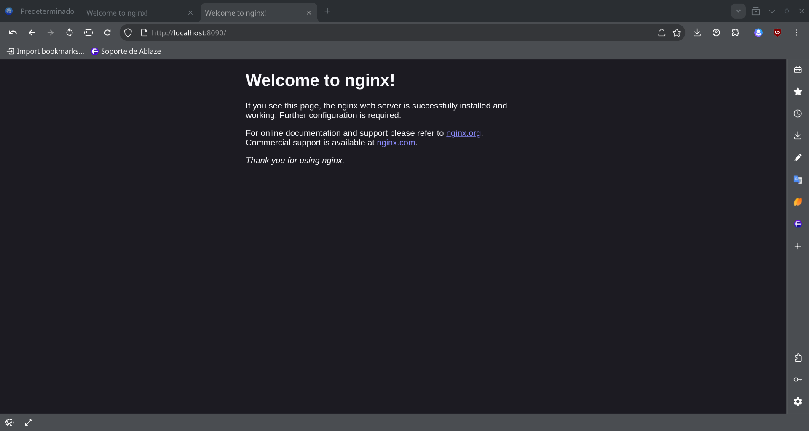
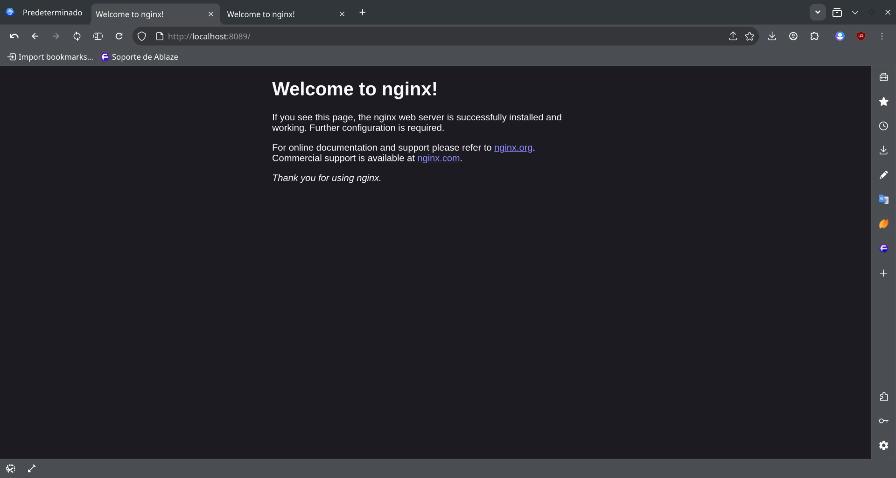

Practica servidor web
1. Titulo
Servidores web con Nginx usando Docker

2. Tiempo de duración
El tiempo usado para hacer la práctica fue de 15 minutos

3. Fundamentos:
Los fundamentos báscios son tener instalado linux, saber los comandos básicos de este sistema para entener el terminal, tener instalado docker que automatiza el despliegue de aplicaciones dentro de contenedores de software, proporcionando una capa adicional de abstracción y automatización de virtualización, crear los sitemas y documentarlos.

4. Conocimientos previos.
Para realizar esta practica el estudiante necesita tener claro los siguientes temas
-Manejo de comando básicos de linux
-Conocimiento basico de Docker
-Manejo del Navegador

5. Objetivos a alcanzar
Implementar contenedores con nginx en navegador
Manipular archivos de configuración para que muestren información con la terminal

6. Equipo necesario:
-Computador con sistema operativo linux
-Docker

7. Material de apoyo.
Documentacion de docker.
Documentación linux

8. Procedimiento:
Paso 1: Crea el primer contenedor Nginx llamado nginx1 exponiendo el puerto 8089: docker run -d --name nginx1 -p 8089:80 nginx
Paso 2: Crea el segundo contenedor Nginx llamado nginx2 exponiendo el puerto 8090: docker run -d --name nginx2 -p 8090:80 nginx
Paso 3:Copia el archivo index.html desde el contenedor nginx1 al sistema anfitrión: docker cp nginx1:/usr/share/nginx/html/index.html ./index1.html
Paso 4: Edita el archivo index1.html con un editor como nano o vi, incluyendo información del instituto.
Paso 5: Copia el archivo editado nuevamente al contenedor nginx1: docker cp index1.html nginx1:/usr/share/nginx/html/index.html

Figura 1-1. 

Figura 1-2.

 
9. Resultados esperados:
Los resulados esperados son que los servidores web se crearan y funcionaran correctamente

10. Bibliografía
Fernández Ginés, X. (2018). Seguridad en Docker.
Palma Pérez, N. (2020). Solución informática para la selección del servidor web durante la migración a código abierto. Revista Cubana de Ciencias Informáticas, 14(2), 49-69.
Docker, I. (2017). Docker documentation. Electronic resource]. Docker Documentation:[website]. URL: https://docs. docker. com/(accessed: 02.05. 2022).